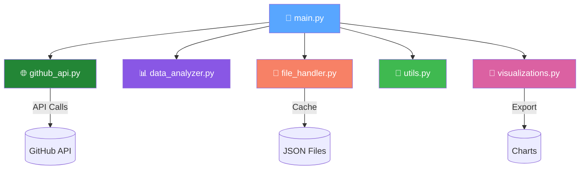

<div align="center">

# 🔮 GitHub Activity Analyzer


<br/>

[](https://python.org)
[](https://docs.github.com/en/rest)
[](https://matplotlib.org/)
[](LICENSE)

<br/>


**🚀 A powerful Python tool that dives deep into any GitHub profile and reveals fascinating insights about coding habits, language preferences, and activity patterns.**

[Features](#-features) •
[Installation](#-installation) •
[Usage](#-usage) •
[Architecture](#-architecture) •
[Contributing](#-contributing)

<br/>


</div>

---

## ✨ Features


### 📊 **Comprehensive Analysis**
- 🔍 Fetch **ALL** repositories (pagination support!)
- 📈 Language distribution breakdown
- ⭐ Top repositories by stars
- 📅 Monthly activity tracking
- 🚀 Recent activity (last 30 days)

### 💬 **Commit Intelligence**
- 🔤 Commit message word analysis
- 📊 Average commits per repository
- ⏰ Peak coding hours detection
- 🗓️ Day-of-week patterns

### 🎨 **Beautiful Visualizations**
- 📺 Terminal-based ASCII charts
- 🖼️ High-quality PNG/PDF exports
- 📊 Pie charts, bar graphs, histograms
- 🌈 Color-coded data representation

### 💾 **Smart Caching**
- 🧠 User-specific cache files
- ⚡ Lightning-fast repeated analysis
- 🔄 Automatic cache invalidation
- 📈 Progress tracking between sessions

<br clear="right"/>

---

## 🎬 Demo

<div align="center">

```
============================================================
                 📊 GITHUB ACTIVITY ANALYSIS                 
============================================================

📂 REPOSITORY OVERVIEW
------------------------------------------------------------
Total Repos : 47
Most Used Programming Language : Python

⭐ TOP REPOSITORIES
------------------------------------------------------------
1. awesome-project - ⭐142 stars
2. ml-toolkit - ⭐89 stars
3. api-framework - ⭐67 stars

📈 LANGUAGE BREAKDOWN
------------------------------------------------------------
🐍 Python        ████████████████████████████ 58%
📘 TypeScript    ████████████ 24%
☕ JavaScript    ██████ 12%
🦀 Rust          ███ 6%

⏰ PEAK ACTIVITY TIME
------------------------------------------------------------
Most Active Hour: 14:00 PM 🔥
```

</div>

---

## 🚀 Installation


### Prerequisites

```bash
# Python 3.8 or higher required
python --version
```

### Quick Start

```bash
# Clone the repository
git clone https://github.com/AnandVadgama/GitHub-Activity-Analyzer.git

# Navigate to project directory
cd GitHub-Activity-Analyzer

# Install dependencies
pip install -r requirements.txt

# Run the analyzer! 🎉
python main.py
```

### Dependencies

```
requests>=2.28.0
matplotlib>=3.5.0
```

---

## 💻 Usage

<div align="center">


</div>

### Basic Usage

```bash
python main.py
```

```
Enter the username to analyze: torvalds
🔍 Fetching repositories for torvalds...
📄 Fetching page 1...
✅ Got 11 repositories from page 1
🎉 Total repositories fetched: 11
```

### Output Files

| File | Description |
|------|-------------|
| `📁 output/` | JSON analysis exports with timestamps |
| `📁 charts/` | PNG & PDF visualization files |
| `📄 commit_message_{user}.json` | User-specific commit cache |

---

## 🏗️ Architecture

<div align="center">



</div>

### 📁 Project Structure

```
📦 GitHub-Activity-Analyzer
├── 🎯 main.py              # Main entry point & orchestration
├── 🌐 github_api.py        # GitHub API interactions (with pagination!)
├── 📊 data_analyzer.py     # Data processing & analysis
├── 💾 file_handler.py      # File I/O & caching logic
├── 🔧 utils.py             # Utility functions
├── 🎨 visualizations.py    # Charts & visual output
├── 📁 output/              # Generated analysis JSON files
├── 📁 charts/              # Generated visualization images
└── 📄 README.md            # You are here! 👋
```

### 🧩 Module Responsibilities

| Module | Purpose |
|--------|---------|
| `main.py` | Entry point, orchestrates the analysis workflow |
| `github_api.py` | Handles all GitHub API calls with pagination & error handling |
| `data_analyzer.py` | Processes raw data into meaningful insights |
| `file_handler.py` | Manages JSON exports and smart caching |
| `utils.py` | Utility functions for calculations |
| `visualizations.py` | Creates terminal & image-based visualizations |

---

## 📊 What Gets Analyzed?

<div align="center">

| Metric | Description | Visualization |
|--------|-------------|---------------|
| 🔤 **Languages** | Distribution across all repos | Pie Chart |
| 📅 **Monthly Activity** | Repository creation patterns | Bar Chart |
| ⏰ **Commit Hours** | When you code most | Histogram |
| ⭐ **Top Repos** | Highest starred repositories | Horizontal Bar |
| 🔍 **Commit Words** | Common words in messages | Word Analysis |
| 📈 **Growth** | Progress between analyses | Comparison |

</div>

---

## 🛠️ Technical Highlights


- **🔄 Pagination Support**: Fetches ALL repositories, not just 30!
- **🧠 Smart Caching**: User-specific cache with automatic invalidation
- **⚡ Efficient**: Minimal API calls with intelligent data reuse
- **🛡️ Robust Error Handling**: Graceful recovery from API issues
- **📊 Dual Visualization**: Both terminal ASCII and high-res images
- **🏗️ Modular Design**: Clean, maintainable code structure

---

## 🤝 Contributing

<div align="center">


</div>

Contributions are welcome! Here's how you can help:

1. 🍴 **Fork** the repository
2. 🌿 **Create** a feature branch (`git checkout -b feature/AmazingFeature`)
3. 💾 **Commit** your changes (`git commit -m 'Add AmazingFeature'`)
4. 📤 **Push** to the branch (`git push origin feature/AmazingFeature`)
5. 🎉 **Open** a Pull Request

---

## 📜 License

<div align="center">

Distributed under the **MIT License**. See `LICENSE` for more information.

<br/>


---

### 💖 Made with Python and Passion


<br/>

[](https://github.com/AnandVadgama/GitHub-Activity-Analyzer/stargazers)
[](https://github.com/AnandVadgama/GitHub-Activity-Analyzer/network/members)

</div>
